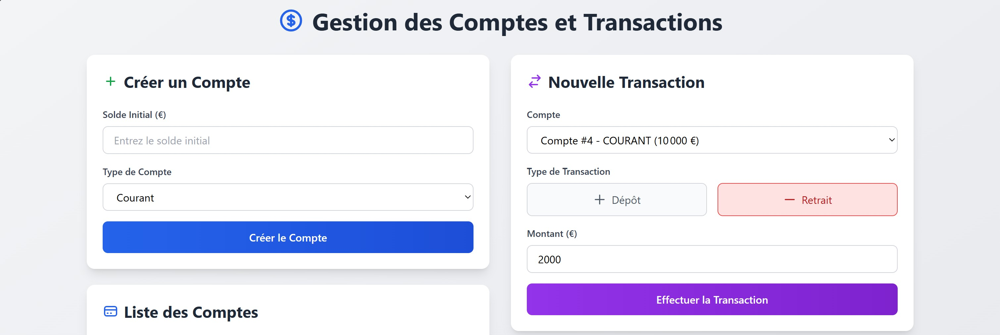

# Gestion des Comptes et Transactions

Application web React avec Apollo Client pour la gestion des comptes bancaires et transactions via une API GraphQL.

## Technologies Utilisées

- **Frontend**: React 19, Apollo Client 4, Tailwind CSS 3
- **Backend**: Spring Boot, GraphQL, H2 Database
- **Outils**: Node.js, Maven

## Installation

### Backend (Spring Boot)

```bash
cd banque-service
mvn spring-boot:run
```
Le serveur démarre sur http://localhost:8082

### Frontend (React)

```bash
cd gestion-comptes
npm install
npm start
```
L'application démarre sur http://localhost:3000

## Fonctionnalités

- ✅ Création de comptes bancaires (Courant/Épargne)
- ✅ Affichage de la liste des comptes
- ✅ Ajout de transactions (Dépôts/Retraits)
- ✅ Historique des transactions
- ✅ Interface responsive avec Tailwind CSS

## Captures d'écran

### Interface Principale


### Création de Compte


### Transaction


### Liste des Transactions


## Structure du Projet

```
TP16/
├── banque-service/          # Backend Spring Boot GraphQL
│   ├── src/main/java/       # Code source Java
│   └── src/main/resources/  # Configuration et schéma GraphQL
├── gestion-comptes/         # Frontend React
│   ├── src/apollo/          # Configuration Apollo Client
│   ├── src/graphql/         # Queries et Mutations GraphQL
│   └── src/components/      # Composants React
└── images/                  # Captures d'écran
```

## API GraphQL

### Queries
- `allComptes` - Récupérer tous les comptes
- `compteById(id)` - Récupérer un compte par ID
- `allTransactions` - Récupérer toutes les transactions
- `totalSolde` - Statistiques des soldes

### Mutations
- `saveCompte(compte)` - Créer un compte
- `addTransaction(transaction)` - Ajouter une transaction

## Auteur

TP16 - Architecture des Composants d'Entreprises
